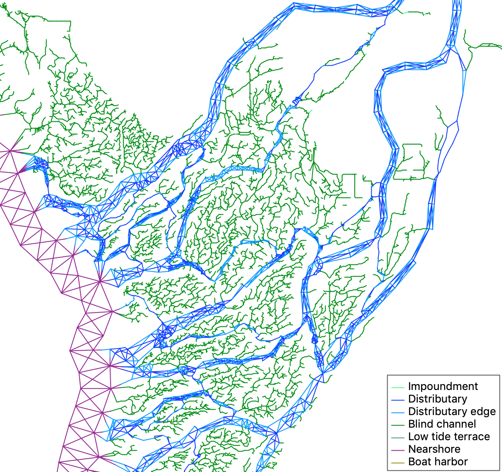

# Individual-based Model of Juvenile Chinook Salmon in the Skagit River Estuary

This repository is a C++ implementation of an individual-based model of the behavior of juvenile Chinook salmon in estuarine waters. The project currently focuses on the Skagit River estuary channel network, although the model itself can be used to simulate other environments.

## Authors

This software is in development by [Abby Bratt](https://github.com/aebratt) and [Kaj Bostrom](https://github.com/alephic).

## About the model

Our model simulates the movement of individual fish through a network of habitat "nodes", each node representing a certain area of waterway accessible to fish.

Pictured is a portion of the map of the Skagit River delta that the model uses - this image was captured from the model GUI.

In order to model cohort statistics such as mean residence time, growth, and habitat preference, we model the bioenergetics of individual fish as well as their mortality risk, and use these models to inform the behavioral model of fish movement. 

Additionally, we use hydrological data to approximate water temperature and flow speed in the simulated environment.

## Setup

Compiling the model and its dependencies requires the following libraries and tools to be installed:

- `automake`
- `autoconf`
- `libtool`
- `zlib`
- `curl`
- `clang`

These dependencies are installable on Mac via [Homebrew](https://brew.sh); once you have installed Homebrew, run `brew install curl automake autoconf libtool zlib` to get the required packages. A version of `clang` is available as part of the XCode developer tools, which can be installed using the command `xcode-select --install`.

If you have any difficulty installing Homebrew, see [Troy's build notes](troys_build_notes.md).

Compilation of the GUI also requires a recent (>=3.0) version of [wxWidgets](https://www.wxwidgets.org). On Mac, this can be obtained using Homebrew with `brew install wxmac`.

1. Open a terminal. Clone this repository, then navigate to your local copy:

        git clone git@github.com:aebratt/fish_cpp_hyak.git 
        cd fish_cpp_hyak

1. RapidJSON should be installed first. Then, fetch additional dependencies (hdf5, netcdf-c, netcdf-cxx) and compile them:

        ./setup.sh

2. Compile the model executables:

        make

    and/or

        make gui

## Running the model

- To run the model without a graphical interface:
        
        bin/headless *name of run listing file* *name of folder where output should be saved* *config file*
        
By default, the model will use the environmental configuration in the file [default_config_env_from_file.json](default_config_env_from_file.json),         which directs the model to load one of the three maps, plus the hydrodynamic and recruit data from files stored in the `data` directory. If you             wish to use another configuration, you can specify it as the third argument to the executable.
        
For example, to test the 2004 map I could run:
  
        bin/headless test_run_listings.csv test_output_2004 config_test_2004_map.json

- To run the graphical model:

        bin/gui *config file* *name of run listing file* *name of folder where output should be saved*
    Note: the order fo the parameters for the GUI version is different from that of headless.

### Output

See [OUTPUT_README.md](OUTPUT_README.md) for documentation on the model's output formats.

## Adapting the model

In order to customize the behavior of the model for a given scenario, there are three main sets of parameters that you will likely
need to modify:

- Parameters that are built into the model and must be specified before compilation:
    - The bioenergetic parameters, defined as constants at the top of [src/fish.cpp](src/fish.cpp)
    - The hydrology model parameters, defined as constants at the top of [src/hydro.cpp](src/hydro.cpp)

- Parameters that are specified via the JSON configuration file and are loaded at runtime:
    - The environment data, including the map definition, recruitment data, and hydrology data
    
        For information on the format of these parameters see [CONFIG_README.md](CONFIG_README.md)

## Release Notes

See [RELEASE_NOTES.md](RELEASE_NOTES.md) for documentation about major changes or additions to the model's feature set. 

